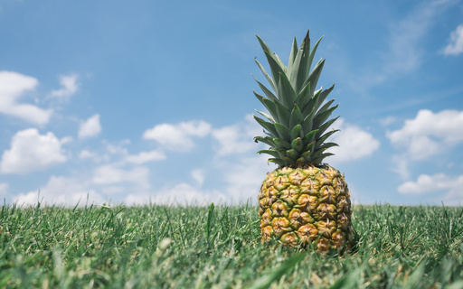
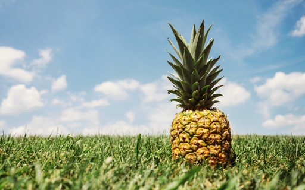

# Pillow LUT tools

Lookup tables loading, manipulating, and generating for
[Pillow][Pillow] library.

You will need to [install Pillow][install Pillow] or
[Pillow-SIMD][install Pillow-SIMD] to work. None of this packages
is included as a dependency to simplify installation of another.

## Documentation

https://pillow-lut-tools.readthedocs.io/en/latest/

## Sample code

```python
from PIL import Image
from pillow_lut import load_hald_image

hefe = load_hald_image('./res/hald.6.hefe.png')
im = Image.open('./res/pineapple.jpeg')
im.filter(hefe).save('./res/pineapple.hefe.jpeg')
```

 


```python
from PIL import Image
from pillow_lut import rgb_color_enhance

lut = rgb_color_enhance(11, exposure=0.2, contrast=0.1, vibrance=0.5, gamma=1.3)
im = Image.open('./res/pineapple.jpeg')
im.filter(lut).save('./res/pineapple.enhance.jpeg')
```

 

```python
from PIL import Image
from pillow_lut import load_hald_image, rgb_color_enhance

hefe = load_hald_image('./res/hald.6.hefe.png')
lut = rgb_color_enhance(hefe, exposure=0.2, contrast=0.1, vibrance=0.5, gamma=1.3)
im = Image.open('./res/pineapple.jpeg')
im.filter(lut).save('./res/pineapple.hefe.enhance.jpeg')
```

 


[Pillow]: https://pillow.readthedocs.io/
[install Pillow]: https://pillow.readthedocs.io/en/latest/installation.html#basic-installation
[install Pillow-SIMD]: https://github.com/uploadcare/pillow-simd#installation
